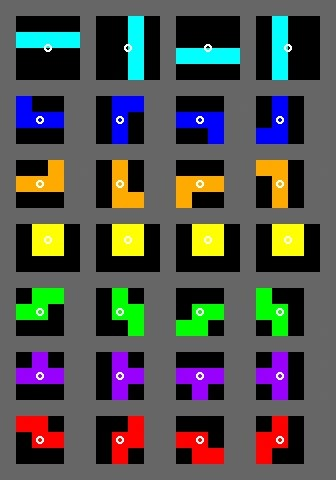
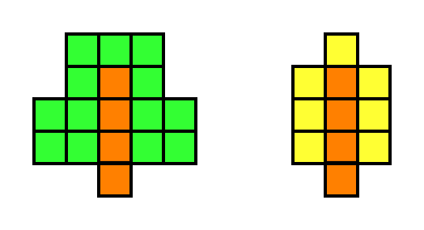

# 俄罗斯麦块 游戏策划案

撰写者：Tu
最终修改日期：2022-3-17

## 目录

- [俄罗斯麦块 游戏策划案](#俄罗斯麦块-游戏策划案)
  - [目录](#目录)
  - [1 文档修改记录](#1-文档修改记录)
  - [2 设计概述](#2-设计概述)
  - [3 详细设计](#3-详细设计)
    - [3.1 游戏区域](#31-游戏区域)
    - [3.2 生成方块](#32-生成方块)
      - [3.2.1 方块外形](#321-方块外形)
      - [3.2.2 方块类型](#322-方块类型)
    - [3.3 方块操作](#33-方块操作)
      - [3.3.1 方块的左右移动](#331-方块的左右移动)
      - [3.3.2 方块的旋转](#332-方块的旋转)
      - [3.3.3 方块的下落](#333-方块的下落)
    - [3.4 方块的固定与结算](#34-方块的固定与结算)
      - [3.4.1 方块的下落固定](#341-方块的下落固定)
      - [3.4.2 方块的特殊效果](#342-方块的特殊效果)
        - [3.4.2.1 泥土](#3421-泥土)
        - [3.4.2.2 草方块](#3422-草方块)
        - [3.4.2.3 花朵方块](#3423-花朵方块)
        - [3.4.2.4 耕地](#3424-耕地)
        - [3.2.2.5 小麦方块](#3225-小麦方块)
        - [3.2.2.6 原木方块](#3226-原木方块)
        - [3.2.2.7 树叶方块](#3227-树叶方块)
        - [3.2.2.8 石头](#3228-石头)
        - [3.2.2.9 黑曜石](#3229-黑曜石)
        - [3.2.2.10 熔炉方块](#32210-熔炉方块)
        - [3.2.2.11 矿石类](#32211-矿石类)
        - [3.2.2.12 红石块](#32212-红石块)
        - [3.2.2.13 TNT 效果](#32213-tnt-效果)
        - [3.2.2.14 红石灯效果](#32214-红石灯效果)
    - [3.5 整行消除](#35-整行消除)
    - [3.6 回合行动顺序](#36-回合行动顺序)
    - [3.7 道具获取](#37-道具获取)
    - [3.8 得分条件](#38-得分条件)
    - [3.9 失败条件](#39-失败条件)
  - [4 美术需求](#4-美术需求)
    - [4.1 UI 设计](#41-ui-设计)
      - [4.1.1 游戏菜单](#411-游戏菜单)
      - [4.1.2 选项菜单](#412-选项菜单)
      - [4.1.3 游戏界面](#413-游戏界面)
    - [4.2 材质贴图](#42-材质贴图)
  - [5 声音需求](#5-声音需求)
    - [5.1 背景音乐](#51-背景音乐)
    - [5.2 音效](#52-音效)

## 1 文档修改记录

| 时间               | 内容                    |
| ------------------ | ----------------------- |
| 2022 年 2 月 11 日 | 创建文档                |
| 2022 年 3 月 17 日 | 调整文档结构并补充内容  |
| 2022 年 8 月 19 日 | 上传至个人 Github Pages |

## 2 设计概述

&#160; &#160; &#160; &#160;在前几日，于 B 站看到某一 UP 主制作了一款以 MC 为主题的俄罗斯方块，深感兴趣。但是对于 UP 制作的游戏存在一定的想法，因此尝试自己通过策划案的方式进行修改。
&#160; &#160; &#160; &#160;游戏的主要玩法基于俄罗斯方块：在一个固定大小的、基于网格的游戏场地中，会不断生成方块下落。玩家可以操控方块左右移动或旋转，并与其他方块组合填充游戏区域。若一整行被完整的填充，则会消除这一行并转化成分数。若堆叠的方块超出了游戏区域的上限，那么游戏就会结束 。
&#160; &#160; &#160; &#160;游戏中生成的方块被替换成了 MC 中的方块，不同方块在下落后会有不同的效果，不同的方块之间也会产生联动效果。

## 3 详细设计

### 3.1 游戏区域

&#160; &#160; &#160; &#160;游戏区域为宽 10，高 20 的长方形区域。
&#160; &#160; &#160; &#160;玩家移动方块、或方块自然下落均以整数格进行移动。
&#160; &#160; &#160; &#160;游戏区域的左侧、右侧、底部为不可越过的区域，不允许方块越过；游戏区域的顶部允许方块通过。如图 1 所示，$\color{red}{红色边框}$表示不允许方块通过；$\color{blue}{蓝色边框}$代表检测方块是否溢出的边线；$\color{yellow}{黄色方格}$代表方块生成时，方块的中心位置。

### 3.2 生成方块

#### 3.2.1 方块外形

&#160; &#160; &#160; &#160;俄罗斯方块中一共存在 7 种不同的方块（方块），分别是 I 型、O 型、J 型、L 型、S 型、Z 型 、T 型。

&#160; &#160; &#160; &#160;生成提供给玩家的方块时，一次生成一包。每一包中 7 种方块一样一个，但顺序随机。这样可以防止玩家连续多次拿到相同方块。

#### 3.2.2 方块类型

方块一共有 3 类 18 种，分别是：

基础类：
| 方块 | 生成概率 |
|:------:|:-----------------------:|
| 泥土 | 10% |
| 草方块 | 20% |
| 花朵 | 0% |
| 耕地方块 | 10% |
| 小麦 | 0% |
| 原木 | 替换所有 I 型方块 |
| 树叶 | 0% |
| 石头 | 40% |
| 黑曜石 | 5% |
| 熔炉 | 10% |
|红石类|5%|

在确定方块为石头后，有一定概率将提供给玩家的方块的每一个方格统一替换成某一种矿石类。具体概率如下：

矿石类：（同 3.2.2.11）
| 方块名称 | 概率 |
| :------: | :--: |
| 煤矿石 | 18% |
| 铁矿石 | 12% |
| 金矿石 | 9% |
| 青金石矿 | 6% |
| 钻石矿 | 3% |

红石类：
| 方块 | 生成概率 |
|:------:|:--------:|
| 红石块 | 30% |
| TNT | 50% |
| 红石灯 | 20% |

整个逻辑过程如图：

### 3.3 方块操作

#### 3.3.1 方块的左右移动

&#160; &#160; &#160; &#160;玩家每次按下左右移动键，方块都会向左或向右移动一格。但方块的左右移动不能超过游戏区域的左右边界。
&#160; &#160; &#160; &#160;每当玩家按下左右移动键后，需要进行一次操作判定：检查方块左右是否紧挨游戏区域边界。若紧挨边界则操作无效。给予玩家错误音效的反馈。

#### 3.3.2 方块的旋转

&#160; &#160; &#160; &#160;玩家每次按下旋转按键时，方块都会按顺时针、沿方块中心旋转 90 度。具体旋转效果见图 3。

&#160; &#160; &#160; &#160;每当玩家按下旋转按键后，进行一次操作判定：检查方块旋转后的位置上，是否已有其他方块存在、是否超出游戏左右和底部边界。若有其他方块阻挡或超过边界，则给予玩家错误音效的反馈。

#### 3.3.3 方块的下落

&#160; &#160; &#160; &#160;若无玩家干扰，方块会以恒定速度下落，下落速度为 1 格/1 秒；
&#160; &#160; &#160; &#160;若玩家单次摁下加速下落键，方块会立即下落一格，而后重新以 1 格/1 秒的恒定速度下落；
&#160; &#160; &#160; &#160;如果玩家长摁加速下落键，则会进入加速下落模式：方块会先以 2 格/1 秒的速度下落 2 格，然后以 5 格/1 秒的速度快速下落。玩家松手时会立刻恢复到正常下落速度。

### 3.4 方块的固定与结算

#### 3.4.1 方块的下落固定

&#160; &#160; &#160; &#160;方块在每次下落前会进行一次判定：若玩家操控的方块遇到其他方块阻挡，或方块已经到达游戏区域的底部，则会固定当前方块。需要允许玩家在方块已到达底部后，仍有一点时间进行左右移动。
&#160; &#160; &#160; &#160;若处在加速下落模式，方块在下落过程中遇到其他方块的阻挡或到达游戏区域底部，会直接与场上其他方块或在游戏区域底部固定，不会有固定前允许左右移动的时间。

#### 3.4.2 方块的特殊效果

##### 3.4.2.1 泥土

&#160; &#160; &#160; &#160;无特殊效果。

##### 3.4.2.2 草方块

&#160; &#160; &#160; &#160;每当有方块落地时，进行一次判定：如果上方为空，有 5%概率在草方块上方生成一格花朵方块。

##### 3.4.2.3 花朵方块

&#160; &#160; &#160; &#160;花朵方块为非实体方块，若有其他方块下落、旋转等占据花朵方块的位置，那么会破坏花朵方块并完成对应操作。
&#160; &#160; &#160; &#160;若花朵方块下方的草方块被破坏，则立刻破坏花朵方块。

##### 3.4.2.4 耕地

&#160; &#160; &#160; &#160;每当有方块落地时，进行一次判定：若耕地上方的方块为空，那么在耕地上方生成一格生长进度为 0%的小麦方块。若上方的小麦方块被破坏，那么仍然有机会重新生成生长进度为 0%的小麦方块。
&#160; &#160; &#160; &#160;若有方块落在耕地方块之上，耕地方块会转化为泥土方块。

##### 3.2.2.5 小麦方块

&#160; &#160; &#160; &#160;小麦方块的只能通过耕地方块生成。

&#160; &#160; &#160; &#160;小麦方块共有五种生长进度，初始状态为 0%，后续有 17%、53%、83%、100%。
&#160; &#160; &#160; &#160;每当有方块落地时，小麦会生长到下一个阶段。小麦的生长会从 0%到 17%，但不会从 100%到 0%。当小麦生长已经到 100%后，再次生长，小麦的生长度会从 100%跳转到 17%，并给与玩家一份小麦物品。

&#160; &#160; &#160; &#160;若小麦方块下方的耕地方块被破坏，那么小麦方块会立即被破坏。若被破坏的小麦生长进度为 100%，那么给予玩家一份小麦物品。
&#160; &#160; &#160; &#160;小麦方块为非实体方块，若有其他方块下落、旋转等占据小麦方块的位置，那么会破坏小麦方块并完成对应操作。

##### 3.2.2.6 原木方块

&#160; &#160; &#160; &#160;原木方块仅会出现在 I 型方块上。
&#160; &#160; &#160; &#160;若 I 型方块竖直落在泥土、草方块、耕地上，则会进行一次判定：若周围一定范围（见图中黄色方格）没有方块阻挡，那么会生成特殊的树状结构（见图左）。
&#160; &#160; &#160; &#160;树状结构由原木与树叶方块构成，若判定通过，但是有方块阻挡，那么会阻止对应位置树叶方块的生成。

##### 3.2.2.7 树叶方块

&#160; &#160; &#160; &#160;树叶方块仅可通过原木方块的特殊效果生成。

&#160; &#160; &#160; &#160;树叶方块为非实体方块，若有其他方块下落、旋转等占据树叶方块的位置，那么会破坏树叶方块并完成对应操作。

##### 3.2.2.8 石头

&#160; &#160; &#160; &#160;无特殊效果。

##### 3.2.2.9 黑曜石

&#160; &#160; &#160; &#160;在当方块固定后，不会随着空行消失而下落，不会被爆炸破坏。

##### 3.2.2.10 熔炉方块

&#160; &#160; &#160; &#160;当有其他方块落地后，熔炉方块会进行一次熔炼判定：首先判断玩家持有物品，是否持有金属矿石与煤炭，然后随机选择一种金属矿石，收取玩家“1 铁矿或 1 金矿”+“1 煤炭”，进入熔炼状态。
&#160; &#160; &#160; &#160;在熔炼状态中，熔炉外观变为点亮熔炉。
&#160; &#160; &#160; &#160;在下一次方块落地后，熔炉退出熔炼状态，外观变为非点亮熔炉，返还玩家对应的熔炼产物“1 铁锭/1 金锭”。

&#160; &#160; &#160; &#160;若熔炉被破坏，那么会返还玩家 1 对应矿石+1 煤炭。
&#160; &#160; &#160; &#160;刚固定的熔炉为普通状态。

##### 3.2.2.11 矿石类

&#160; &#160; &#160; &#160;矿石类有煤矿、铁矿、金矿、青金石矿、钻石矿。
&#160; &#160; &#160; &#160;当方块类型确定为石头时，有概率将一个俄罗斯方块含有的所有单独方块统一转变为石头方块。具体概率如下：

| 方块名称 | 概率 |
| :------: | :--: |
|  煤矿石  | 18%  |
|  铁矿石  | 12%  |
|  金矿石  |  9%  |
| 青金石矿 |  6%  |
|  钻石矿  |  3%  |

&#160; &#160; &#160; &#160;矿石方块只有在被消除时，才会生成对应的矿物：煤炭、铁矿、金矿、青金石、钻石。这些矿物会进入玩家的物品栏存储。

##### 3.2.2.12 红石块

&#160; &#160; &#160; &#160;红石块在落地、固定后，会向上下左右四个方向辐射红石信号。除此以外无其他特殊效果。
&#160; &#160; &#160; &#160;部分方块在接受到红石信号之后，会有额外的动作：

- 3.2.2.10 的熔炉方块，如果熔炉在接收到红石信号时为普通状态，则不会进入熔炼模式。
- 3.2.2.13 的 TNT 会在接收到红石信号后进入引燃状态。
- 3.2.2.14 的红石灯方块会在接收到红石信号后点亮

##### 3.2.2.13 TNT 效果

&#160; &#160; &#160; &#160;TNT 方块在固定后会检测是否有红石信号。如果有红石信号，则会进入引燃状态。
&#160; &#160; &#160; &#160;进入引燃状态的时候会有一个特殊的动画：TNT 会略微向上，左右方向随机的跳动一下；同时会有 3 秒的白色闪烁效果。在倒计时持续的过程中，白色闪烁频率会逐渐加快，并且在倒计时结束前一刹那，TNT 方块会放大一点。
&#160; &#160; &#160; &#160;引燃状态结束则会进行一次爆炸判定：破坏以该方块为中心，半径为 4 的圆形区域。若黑曜石阻挡，则黑曜石及背后的方块不会被破坏。
&#160; &#160; &#160; &#160;若爆炸过程中炸到其他 TNT 方块，则会引燃其他 TNT 方块，使其立即爆炸。

##### 3.2.2.14 红石灯效果

&#160; &#160; &#160; &#160;落地后，如果红石灯方块收到红石信号，那么会 “点亮”红石灯，更改红石灯方块的贴图为点亮贴图，同时发光。
&#160; &#160; &#160; &#160;在点亮后，每回合需要进行一次检测，如果红石信号消失，那么红石灯会熄灭。

### 3.5 整行消除

&#160; &#160; &#160; &#160;当一行 10 格全部被方块填满时，会消除这一行，并让所有上面方块立刻下移一格。
&#160; &#160; &#160; &#160;如果有多行被同时填满，则会同时消除多行，并依次移动上面全部的方块。
&#160; &#160; &#160; &#160;整行消除时，需要以特效提示玩家。
&#160; &#160; &#160; &#160;消除不同的特殊物品会给予玩家不同的分值，具体如下：

|    方块名称    | 得分 |
| :------------: | :--: |
|      泥土      |  0   |
|     草方块     |  5   |
|      花朵      |  5   |
|    耕地方块    |  0   |
|      小麦      |  15  |
|      原木      |  15  |
|      树叶      |  5   |
|      石头      |  0   |
|     黑曜石     |  20  |
|      熔炉      |  5   |
|     红石块     |  10  |
|      TNT       |  20  |
| 红石灯（熄灭） |  10  |
| 红石灯（点亮） |  20  |

### 3.6 回合行动顺序

&#160; &#160; &#160; &#160;一回合为从方块生成，由玩家开始操控开始，到下一次方块生成结束。
&#160; &#160; &#160; &#160;回合开始时，首先从包中取出一个方块，然后交给玩家控制。玩家操控方块落地固定为第一阶段。
&#160; &#160; &#160; &#160;第二阶段检测红石信号，检查是否有方块受到红石信号的影响需要进行状态的改变，如：熔炉、红石灯、TNT 等。
&#160; &#160; &#160; &#160;第三阶段是发动不同方块的效果，如：TNT 的爆炸、熔炉的熔炼、小麦生长、耕地变土、树木生成等等。
&#160; &#160; &#160; &#160;第四阶段是检查是否有整行被填满。进行消除并移动。
&#160; &#160; &#160; &#160;第四阶段结束后会结束当前回合，进入下一个方块的生成。

### 3.7 道具获取

&#160; &#160; &#160; &#160;通过 3.2.2.10 熔炉效果，可以消耗、获取道具。
&#160; &#160; &#160; &#160;通过 3.5 整行消除，消除对应方块可以获得道具。具体如下：

| 方块名称 |       效果        |
| :------: | :---------------: |
|  煤矿石  |  给予 1-5 个煤炭  |
|  铁矿石  | 给予 1-5 个铁矿石 |
|  金矿石  |  给予 1 个金矿石  |
| 青金石矿 | 给予 1-7 个青金石 |
|  钻石矿  |  给予 1-3 个钻石  |

### 3.8 得分条件

&#160; &#160; &#160; &#160;单次消除一行的获得 100 分积分；
&#160; &#160; &#160; &#160;单次消除多行的，依次获得 20、40、80、100 积分。
&#160; &#160; &#160; &#160;方块在固定后的特殊效果得分累加。
&#160; &#160; &#160; &#160;通过 3.5 整行消除获得积分。
&#160; &#160; &#160; &#160;在游戏结束后，会根据玩家持有的道具进行积分累加结算，具体分值如下：

| 道具名称 | 得分 |
| :------: | :--: |
|   煤炭   |  5   |
|  铁矿石  |  2   |
|  金矿石  |  4   |
|   铁锭   |  8   |
|   金锭   |  16  |
|  青金石  |  30  |
|   钻石   | 100  |

### 3.9 失败条件

&#160; &#160; &#160; &#160;当方块固定后超过游戏区域的上部边界，则判定游戏失败。
&#160; &#160; &#160; &#160;统计玩家手上道具的分数，并与方块消除的得分累加作为最终得分。

## 4 美术需求

### 4.1 UI 设计

#### 4.1.1 游戏菜单

&#160; &#160; &#160; &#160;游戏主界面左侧为一张游戏区域的截图，需要展示多种游戏元素。
&#160; &#160; &#160; &#160;右侧为按键选择，从上至下依次为：开始游戏、选项、退出游戏。

#### 4.1.2 选项菜单

&#160; &#160; &#160; &#160;选项菜单为半透明，浮现在主菜单上。内有多个选项设置，如音量修改。
&#160; &#160; &#160; &#160;选项彩蛋右上角有一个按钮可以退出菜单。也可以通过点击菜单外的地方退出菜单。

#### 4.1.3 游戏界面

&#160; &#160; &#160; &#160;游戏界面主要有三部分，占据左侧大部分空间的游戏区域、右上角的得分统计，以及右下角的玩家持有道具的展示。

### 4.2 材质贴图

&#160; &#160; &#160; &#160;大部分材质可以从 Minecraft 中选用。
游戏中方块的材质：

- 泥土材质
- 草方块材质
- 花朵材质（使用红色花朵与黄色花朵组合）
- 耕地方块材质
- 小麦材质
- 原木材质
- 树叶材质
- 石头材质
- 黑曜石材质
- 熔炉材质
- 煤矿石材质
- 铁矿石材质
- 金矿石材质
- 青金石矿材质
- 钻石矿材质
- 红石块材质
- TNT 材质
- 红石灯材质，含点亮与熄灭两种
- 基岩材质（用于游戏边框）
- 游戏中道具的材质：
- 煤炭
- 铁锭
- 金锭
- 青金石
- 钻石
- TNT 爆炸时候的特效：
- TNT 粒子材质

## 5 声音需求

### 5.1 背景音乐

考虑到游戏是 MC 题材的俄罗斯方块游戏，可以选取：

- MC 内的音乐
- MC 音色的俄罗斯方块主题音乐
- 较为舒缓放松的休闲游戏音乐

### 5.2 音效

- 方块固定时候的有一个音效
- 植物被破坏的时候有一个音效
- 方块被破坏时候的音效
- TNT 被引燃时候的音效
- TNT 爆炸时候的音效
- 熔炉返还物品时候的音效
- 矿石类被消除时候的音效
- 整行消除的时候的音效
